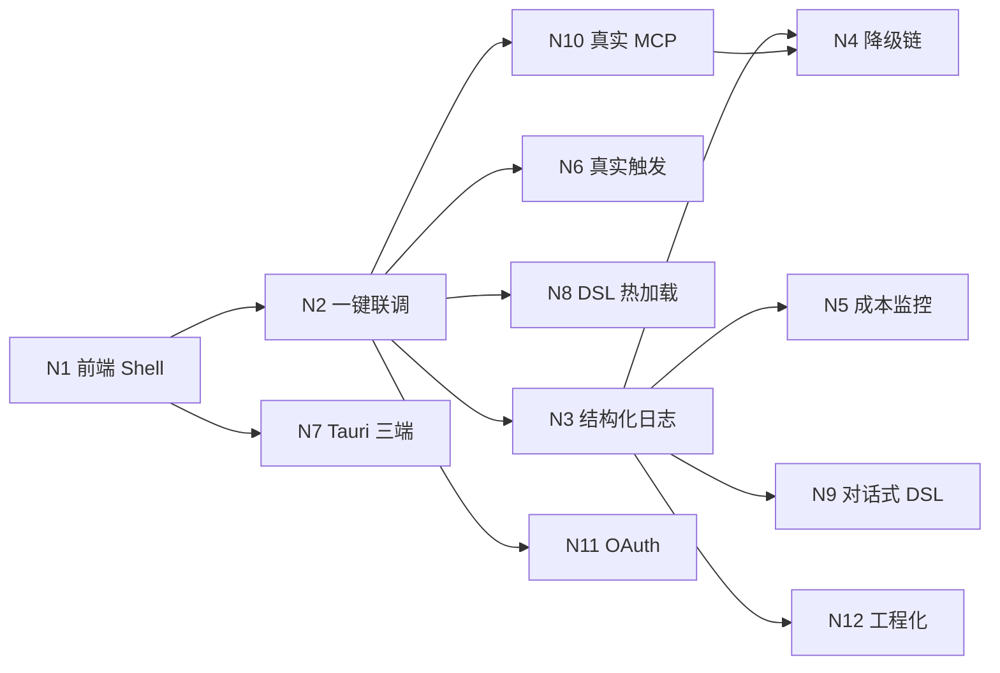

# ROADMAP.md

> **版本说明**：本文件已按「已实现模块分类 + 问题/待办 + 完整后续计划」重构。
> 编号说明：原 ROADMAP 的 T1–T19 与方案.md 原子任务清单编号不一致；已完成工作按方案.md 编号（T1–T15）+ INT（集成收尾）推进。
> 新计划统一使用 **N1、N2…**（Next），避免与历史编号混淆。

---

## 一、阶段总览

| 阶段 | 目标 | 状态 |
|------|------|------|
| **P0 · 地基** | DSL 编译 + Schema 校验 | ✅ 完成 |
| **P1 · 联邦** | Agent Registry + Claude Code 接入 + Hub Graph | ✅ 完成 |
| **P2 · 跨端** | Device Mesh + WS Server + Task Orchestrator + Sync | ✅ 完成 |
| **P3 · Shell 前端** | UI 渲染器 + DSL 编辑器 + 插件加载器 | ⚠️ 组件完成，**应用壳未完成** |
| **P4 · 端到端** | 示例插件/工作流 + E2E + 集成收尾 | ✅ 完成 |
| **P5 · 可观测** | 日志 + 降级链 + 成本监控 | ❌ 未开始 |
| **P6 · 可运行 Shell** | 前端入口 + Tauri 三端 + 真实触发 | ❌ 未开始（建议优先） |
| **P7 · 生产加固** | 真实 MCP / OAuth / 热加载 / 对话式 DSL | ❌ 未开始 |

---

## 二、已实现模块分类

### A. DSL 层（声明式扩展）

| 模块 | 路径 | 能力 | 验收 |
|------|------|------|------|
| DSL Compiler | `dsl/compiler.py` | 四类 DSL → 结构化 dict；`DSLParseError` 含行号 | ✅ |
| JSON Schema 校验 | `dsl/schema.py` | 4 类独立 Schema；缺字段/类型/非法值；返回错误列表 | ✅ |
| DSL 示例 | `dsl/examples/*.yaml` | workflow/plugin/agent/trigger + 错误样例 | ✅ |
| DSL 编辑器 | `src/shell/dsl-editor.*` | 文件/表单双模式；打开/保存；保存前校验 | ✅ |

### B. Agent 联邦层

| 模块 | 路径 | 能力 | 验收 |
|------|------|------|------|
| Agent Registry | `agent_hub/registry.py` | 注册/匹配/异步调用；`AgentNotFoundError` | ✅ |
| Claude Code Adapter | `agent_hub/adapters/claude_code.py` | HTTP/MCP 调用；超时/失败 `fallback` | ✅ |
| Hub Graph | `agent_hub/graph.py` | LangGraph 意图路由（代码/RAG/workflow/chat） | ✅ |
| Hub↔Orch 接线 | `integration/hub_bridge.py` | workflow 路径真实提交 TaskOrchestrator | ✅ |

### C. 跨端层（Device Mesh + 通信）

| 模块 | 路径 | 能力 | 验收 |
|------|------|------|------|
| Device Mesh | `device_mesh/registry.py` | 设备注册、能力路由、在线状态 | ✅ |
| 消息协议 | `device_mesh/protocol.py` | MessageType/ErrorCode/parse/build | ✅ |
| 连接管理 | `device_mesh/connection_manager.py` | 点对点/广播/gather | ✅ |
| 心跳检测 | `device_mesh/heartbeat.py` | 60s 超时踢出 | ✅ |
| WebSocket Server | `device_mesh/ws_server.py` | FastAPI WS、HMAC 签名、`NETWORK_MODE` | ✅ |
| 客户端样例 | `device_mesh/client_example.py` | 注册→心跳→指数退避重连 | ✅ |

### D. 任务与同步层

| 模块 | 路径 | 能力 | 验收 |
|------|------|------|------|
| Task Orchestrator | `task_orchestrator/engine.py` | 状态机、排队、上线分发、5min 超时 | ✅ |
| Sync Engine | `sync/sync_engine.py` | 版本号 + changelog 增量 + 乐观锁 + 广播 | ✅ |

### E. Shell / 前端组件（无应用入口）

| 模块 | 路径 | 能力 | 验收 |
|------|------|------|------|
| UI Schema 渲染器 | `src/shell/schema-renderer.*` | form/list/chat/chart 白名单 + 友好提示 | ✅ |
| UI 注册表 | `src/shell/ui-registry.ts` | 类型白名单 + resolveUiSchema | ✅ |
| DSL 编辑器 | `src/shell/dsl-editor.*` | 双模式编辑 | ✅ |
| 插件加载器（Rust） | `src-tauri/src/plugin_loader.rs` | 扫描 manifest，坏文件跳过 | ✅ |

### F. 示例与集成

| 模块 | 路径 | 能力 | 验收 |
|------|------|------|------|
| notes 示例插件 | `plugins/example/` | UI + tools + 运行时 | ✅ |
| 多场景 Workflow | `plugins/example/workflows/*.yaml` | cron/webhook/file/跨端 4 场景 | ✅ |
| Workflow 执行器 | `plugins/example/workflow_runner.py` | 模板变量 + tool/agent 分发 | ✅ |
| E2E 编排 | `tests/e2e/` | 手机→PC→平板 + trace_id | ✅ |
| 集成接线 | `integration/` | HubStack + WS 真链路 + Sync→广播 | ✅ |

### G. 测试资产

| 类别 | 数量 | 入口 |
|------|------|------|
| Python 单测 + 集成 | 198 | `python -m unittest discover -s tests` |
| JS 组件测试 | 37 | `node --experimental-strip-types tests/js/*.mjs` |
| Rust 单测 | 8 | `cargo test`（`src-tauri/`） |
| 性能测试 | 100 并发注册 < 1s | `python tests/perf_ws.py` |

---

## 三、已知问题 / 技术债

| # | 问题 | 影响 | 优先级 |
|---|------|------|--------|
| P-1 | **前端无应用入口**（无 index.html/main.tsx/Vite） | 无法「点开看」，前端成果不可演示 | 高 |
| P-2 | **Tauri 只是库 crate**，非完整三端应用 | 无 Win/Android/平板窗口 | 高 |
| P-3 | Claude 适配器为简化 `POST /mcp/invoke` | 与完整 MCP 协议不兼容（`# 需确认当前版本API`） | 高 |
| P-4 | 意图识别为规则关键词 | 覆盖有限，无 LLM 兜底 | 中 |
| P-5 | trigger 仅 DSL 声明，无真实 cron/webhook/file 调度 | 自动化场景无法真正自动 | 高 |
| P-6 | YAML 在 Rust/前端侧是子集解析 | 复杂 DSL 可能误解析 | 中 |
| P-7 | E2E 为 TestClient/FakeWS/进程内 | 跨进程/跨机/真设备未验证 | 中 |
| P-8 | monaco-editor 未接入（textarea 替代） | DSL 编辑体验弱 | 低 |
| P-9 | OAuth 未做（HMAC 临时） | 安全不达生产 | 中 |
| P-10 | 无 CI、无统一启动脚本、plan.md 位置分散 | 工程化弱 | 中 |
| P-11 | Sync 为 SQLite 中心式，未升级 CRDT | 多主/弱网场景受限 | 低 |
| P-12 | 对话式生成 DSL + diff 确认未实现 | 方案「禁止项」对应的保护流缺失 | 中 |

---

## 四、待实现功能清单（与后续步骤对齐）

### 必须（P6 可运行 Shell）
1. 最小可跑前端入口（Vite + React）
2. 一键拉起：WS 服务 + 前端 dev server
3. Tauri 2.0 三端骨架（至少 Win 端可开窗）
4. 真实触发调度（cron 起步，webhook/file 随后）

### 应该（P5 可观测 + P7 生产加固）
5. T17 结构化日志（trace_id/device_id/agent_name）
6. T18 降级链（Cloud API → Ollama → 规则）
7. T19 成本监控（Token 10000 熔断）
8. DSL 热加载
9. 对话式生成 DSL + diff 确认
10. 真实 MCP 协议替换
11. OAuth 鉴权

### 可以（增强）
12. monaco-editor 接入
13. Sync CRDT 升级
14. CI / lint / 统一脚本
15. Plugin 市场 / 多用户（v0.3）

---

## 五、后续执行计划（N 系列）

> 顺序按「先能看见 → 再能跑服务 → 然后可观测 → 最后生产加固」。
> 每个 Task 遵循 EXECUTION_PROTOCOL：先 Spec → 逐子任务 → 验收 → 回写 plan.md。

### N1 · 最小可跑前端 Shell
- **输入**：`src/shell/*`（已有组件）
- **输出**：
  - `index.html` + `src/main.tsx` + Vite 配置
  - `package.json` 增加 `dev` / `build` scripts
  - 页面挂载：插件列表（SchemaRenderer）+ DSL 编辑器（DslEditor）+ 示例 notes 插件
- **验收**：
  - [x] `npm run dev` 可打开页面
  - [x] 示例插件 UI（列表）可见
  - [x] DSL 编辑器可打开/保存 yaml，保存前校验生效

### N2 · 一键启动与前后端联调
- **输入**：`device_mesh/ws_server.py` + `integration/`
- **输出**：启动脚本（拉起 WS + 前端）；前端经 WebSocket 连接 Hub
- **验收**：
  - [x] 单脚本启动后端 + 前端
  - [x] 页面触发任务 → 后端执行 → 页面收到结果（真 WS 链路）

### N3 · 结构化日志（P5 · T17）
- **输入**：全模块埋点
- **输出**：JSON 日志，含 `trace_id / device_id / agent_name / workflow_name / task_status / latency_ms`
- **验收**：
  - [x] 单次任务可在日志中完整追溯
  - [x] E2E 场景下所有阶段共用同一 trace_id

### N4 · 降级链（P5 · T18）
- **输入**：Agent 调用路径
- **输出**：Cloud API → Ollama → 规则兜底
- **验收**：
  - [x] 模拟 API 不可用，自动切 Ollama
  - [x] 全不可用时返回规则兜底（`degradation_level=2`）

### N5 · 成本监控（P5 · T19）
- **输出**：Token 消耗 / 延迟 / 成本；单任务 Token 上限 10000 超限熔断
- **验收**：
  - [x] 超限任务被熔断
  - [x] 输出 `tokens_used / latency_ms / degradation_level`

### N6 · 真实触发调度
- **输入**：`Trigger DSL` + `plugins/example/workflows/`
- **输出**：cron 调度器（webhook/file 随后）
- **验收**：
  - [x] daily_report 可按 cron 真实触发执行
  - [x] 修改 cron 表达式热生效（可与 N8 合并）

### N7 · Tauri 三端骨架
- **输入**：`src-tauri/` + N1 前端
- **输出**：完整 Tauri 2.0 应用（Win 优先，Android/平板随后）
- **验收**：
  - [x] 命令层 list_plugins / read_text_file / write_text_file（与 TauriBridge 对齐）
  - [x] 引入 tauri 2 依赖 + tauri.conf.json + icons
  - [x] `cargo test` / `cargo build` 通过（main.rs 启动 WebView）
  - [ ] 本机实际弹出 Win 窗口（需 `cargo run` / `tauri dev` 人工确认）

### 后端 `/api/*`（REST）
- [x] 会话 / 任务 / Agent / 文件 / stream 端点

### N8 · DSL 热加载
- **输入**：监听 `plugins/` 目录
- **输出**：保存 DSL 后 2s 内生效，Hub 不重启
- **验收**：
  - [x] 新增 `.yaml` 2s 内生效
  - [x] 修改 DSL 后工具列表自动更新

### N9 · 对话式生成 DSL
- **输入**：用户自然语言
- **输出**：LLM 生成 DSL → 展示 diff → 用户确认才落盘
- **验收**：
  - [x] 生成的 DSL 通过 Schema 校验
  - [x] 未确认不写盘（对应方案「禁止项」）

### N10 · 真实 MCP 协议
- **输入**：`agent_hub/adapters/claude_code.py`
- **输出**：替换简化端点为完整 MCP（JSON-RPC / stdio）
- **验收**：
  - [x] JSON-RPC initialize / tools/call 可用（MockTransport 验证）
  - [x] 超时/失败降级行为保持（fallback）
  - [x] DualProtocolAdapter 双模式（mcp/rest）
  - [ ] 真实 Claude Code MCP Server 连通（待本机服务）

### N11 · OAuth 鉴权
- **输出**：OAuth 风格 token（access/refresh），可替换 HMAC 临时方案
- **验收**：
  - [x] 未授权设备无法注册
  - [x] token 过期可续期

### N12 · 工程化加固
- **输出**：CI、lint（py_compile + cargo fmt）、统一 `scripts/`、requirements.txt
- **验收**：
  - [x] 一条命令跑全量测试（Py + JS + Rust）
  - [x] CI 红灯即失败

### 可选（N13+）
- monaco-editor 接入 DSL 编辑器
- Sync CRDT 升级
- Plugin 市场 / 多用户
- 跨机/真设备 E2E

### 自定义 LLM
- [x] 配置模型 + API 密钥（加密存储）
- [x] 前端可配置 API、选择模型
- [x] 支持拉取服务商模型列表

### MCP 识别（前端）
- [x] 普通人可操作面板：填地址 → 检测连接 → 显示服务名与工具
- [x] 后端 `/api/mcp/probe` 真实 JSON-RPC 探测
- [x] 演示 MCP Server（`npm run mcp:demo`）无需外部服务即可自测

---

## 六、依赖关系（关键路径）

**关键路径**：N1 → N2 → N3 →（N4/N5/N6/N7/N8/N9/N10/N11/N12）

---

## 八、前端三层架构计划（F 系列）

> 三端（Win / Android / 平板）共用。视图层 + 状态层 + 服务层。
> 默认决策：实时通道以 **WebSocket** 为主（事件总线可换 SSE）；文件走 **Hub 集中存储 + 本地引用**。

| # | 任务 | 内容 | 状态 |
|---|------|------|------|
| **F0** | 契约 | 三态 DTO / 事件名 / REST 路径（`src/contracts/`） | ✅ |
| **F1** | 状态层 | 会话 / 任务 / Agent 三 Store + 订阅（`src/state/`） | ✅ |
| **F2** | 服务层 | REST 客户端、WS/SSE 事件总线、文件上传 | ❌ |
| **F3** | 视图层 | 对话区、任务面板、结果卡片、文件区 | ❌ |
| **F4** | 三端适配 | 响应式布局 + Tauri IPC / 设备能力桥 | ❌ |

### F2 · 服务层
- [x] REST 封装（对接 `API.*`）
- [x] WS/SSE 统一 EventBus（对接 `EVENTS.*`）
- [x] 文件上传（Hub 集中存储 + `FileRef`）

### F3 · 视图层
- [x] 对话区（消息流 + 流式）
- [x] 任务面板（状态列表）
- [x] 结果卡片（TaskResult）
- [x] 文件区（上传 / 列表）

### F4 · 三端适配
- [x] 响应式布局
- [x] Tauri IPC 桥

- [ ] 不编造 API：不确定处标注 `# 需确认当前版本API`
- [ ] 不写死功能：业务逻辑必须可被 DSL 覆盖
- [ ] 不跳过验收：每个 Task 验收通过才标完成
- [ ] 对话式生成的 DSL 必须经 Schema 校验 + 用户确认才落盘
- [ ] 单任务 Token 上限 10000；外部 Agent 超时 120s

## P6 · 前端生产化（FE）— 规划中

详见 `目录/前端优化规划.md`。执行前需确认：功能清单 / 三端范围 / 设计风格 / 数据交互 / 性能要求。
