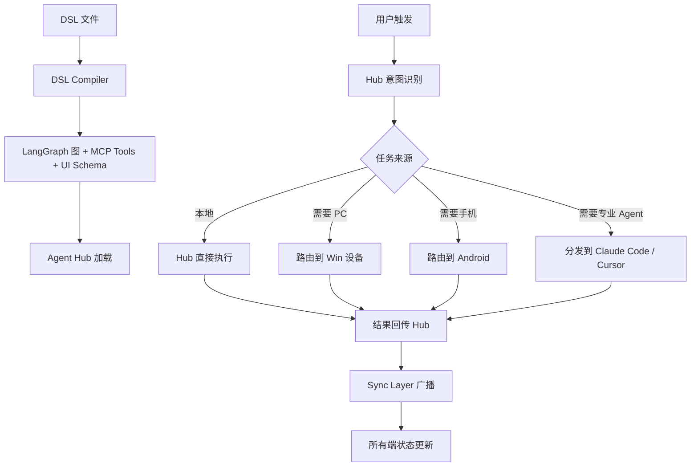

## 第一层：架构设计

### 选型：Hub-and-Spoke Agent 联邦 + DSL 编译层

```
┌──────────────────────────────────────────────────────────────┐
│                    DSL Layer（声明式）                        │
│  Plugin DSL · Workflow DSL · Agent DSL · Trigger DSL          │
│                    ↓ DSL Compiler ↓                           │
└──────────────────────────┬───────────────────────────────────┘
                           ▼
┌──────────────────────────────────────────────────────────────┐
│              Agent Hub（本地 Runtime · LangGraph）            │
│  ┌──────────────────────────────────────────────────────┐    │
│  │  Agent Registry（Agent 注册表）                       │    │
│  │  ├─ Built-in Agent（本地 LangGraph）                  │    │
│  │  ├─ Claude Code Adapter（MCP Server）                 │    │
│  │  ├─ Cursor Adapter（Extension Bridge）                │    │
│  │  └─ External Agent（A2A Protocol）                    │    │
│  └──────────────────────────────────────────────────────┘    │
│  ┌──────────────────────────────────────────────────────┐    │
│  │  Task Orchestrator（任务编排）                        │    │
│  └──────────────────────────────────────────────────────┘    │
└──────────────────────────┬───────────────────────────────────┘
                           ▼
┌──────────────────────────────────────────────────────────────┐
│              Device Mesh（设备网格）                          │
│  ┌────────┐    ┌────────┐    ┌────────┐                     │
│  │ Win PC │◄──►│ Tablet │◄──►│Android │                     │
│  │ (执行) │    │ (展示) │    │ (触发) │                     │
│  └────────┘    └────────┘    └────────┘                     │
│  设备注册 · 能力声明 · 任务路由 · 状态同步                    │
└──────────────────────────────────────────────────────────────┘
```

### 三个核心设计决策

**决策 1：Agent Hub 是联邦中心，不是唯一的 Agent**

本地 LangGraph Runtime 只负责**意图识别、任务路由、状态协调**；具体任务分发给专业 Agent 执行。

| Agent              | 接入方式             | 能力                 |
| ------------------ | ---------------- | ------------------ |
| Built-in LangGraph | 内置               | 通用编排、RAG、工具调用      |
| Claude Code        | MCP Server       | 代码生成、文件操作、Shell    |
| Cursor             | Extension Bridge | 代码补全、IDE 内操作       |
| 外部 Agent           | A2A Protocol     | 任意，只要声明 Agent Card |

**决策 2：DSL 是唯一的"扩展入口"**

用户不改代码，只写 DSL。DSL 编译器把声明转成 LangGraph 图 + MCP Tools + UI Schema。

**决策 3：任务跨端 = 任务声明 + 设备匹配**

每个任务在 DSL 中声明 `device: pc | mobile | any`，Hub 根据设备在线状态和能力路由。

### 状态流转图



### DSL 设计（核心）

四种 DSL，各自独立，可组合：

**1. Workflow DSL**（定义任务流）
```yaml
name: weekly_report
trigger:
  type: cron
  cron: "0 9 * * 1"
device: pc                    # 必须 PC 执行
steps:
  - id: fetch
    tool: excel.read
    args: { path: "{{ env.REPORT_PATH }}" }
  - id: summarize
    agent: claude_code        # 调用外部 Agent
    prompt: "总结：{{ steps.fetch.output }}"
  - id: push
    tool: feishu.send
    args: { chat: "team", content: "{{ steps.summarize.output }}" }
```

**2. Plugin DSL**（定义 UI + Tools）
```yaml
name: notes
version: 1.0.0
ui:
  type: list
  props: { title: "笔记列表", source: "notes.list" }
tools:
  - name: notes.list
    description: 列出所有笔记
    parameters: { type: object, properties: {} }
  - name: notes.create
    description: 创建笔记
    parameters:
      type: object
      properties:
        title: { type: string }
        content: { type: string }
```

**3. Agent DSL**（定义自定义 Agent）
```yaml
name: code_reviewer
base: claude_code            # 继承哪个基础 Agent
system_prompt: |
  你是代码审查专家。只输出 JSON：
  {"issues": [...], "severity": "high|medium|low"}
tools: [filesystem.read, git.diff]
```

**4. Trigger DSL**（定义触发条件）
```yaml
name: on_feishu_message
type: webhook
source: feishu
filter:
  chat_id: "oc_xxx"
  keyword: ["周报", "报告"]
action:
  workflow: weekly_report
```

### 对外契约

**Device Registration Schema**：
```
{
  "device_id": "string",
  "device_type": "pc | tablet | mobile",
  "capabilities": ["file.read", "shell.exec", "camera", "notifications"],
  "online": true,
  "last_seen": 1234567890
}
```

**Task Schema**：
```
{
  "task_id": "uuid",
  "workflow": "string",
  "device": "pc | tablet | mobile | any",
  "status": "pending | assigned | running | done | failed",
  "assigned_to": "device_id",
  "created_at": 1234567890,
  "result": {}
}
```


## 第二层：工程实现

### DSL 编译器（核心）

```python
# dsl/compiler.py — 把 DSL 编译为可执行图
import yaml
from pathlib import Path
from typing import Dict, Any

class DSLCompiler:
    """DSL → LangGraph 图 + MCP Tools + UI Schema"""

    def compile_workflow(self, yaml_path: str) -> Dict[str, Any]:
        """编译 Workflow DSL"""
        with open(yaml_path, encoding="utf-8") as f:
            spec = yaml.safe_load(f)

        # 校验必填字段
        if not spec.get("name") or not spec.get("steps"):
            raise ValueError(f"DSL 格式错误: {yaml_path}")

        # 编译为节点列表
        nodes = []
        for step in spec["steps"]:
            nodes.append({
                "id": step["id"],
                "type": "tool" if "tool" in step else "agent",
                "target": step.get("tool") or step.get("agent"),
                "args": step.get("args", {}),
                "prompt": step.get("prompt"),
            })

        return {
            "name": spec["name"],
            "trigger": spec.get("trigger"),
            "device": spec.get("device", "any"),
            "nodes": nodes,
        }

    def compile_plugin(self, yaml_path: str) -> Dict[str, Any]:
        """编译 Plugin DSL → UI Schema + MCP Tool 声明"""
        with open(yaml_path, encoding="utf-8") as f:
            spec = yaml.safe_load(f)
        return {
            "ui": spec.get("ui"),
            "tools": spec.get("tools", []),
        }
```

### Agent Registry（联邦中心）

```python
# agent_hub/registry.py — Agent 注册表
from typing import Dict, Any, Callable

class AgentRegistry:
    """管理本地 + 外部 Agent"""

    def __init__(self):
        self.agents: Dict[str, Dict[str, Any]] = {}

    def register(self, name: str, adapter: Callable, capabilities: list):
        """注册一个 Agent（本地或外部）"""
        self.agents[name] = {
            "adapter": adapter,
            "capabilities": capabilities,
        }

    def list_agents(self) -> list:
        return list(self.agents.keys())

    def match(self, capability: str) -> list:
        """按能力匹配 Agent"""
        return [
            name for name, meta in self.agents.items()
            if capability in meta["capabilities"]
        ]

    async def invoke(self, name: str, prompt: str, **kwargs) -> Any:
        """调用指定 Agent"""
        if name not in self.agents:
            raise ValueError(f"未知 Agent: {name}")
        return await self.agents[name]["adapter"](prompt, **kwargs)
```

### Claude Code 适配器（MCP Client）

```python
# agent_hub/adapters/claude_code.py
import httpx
from typing import Any

class ClaudeCodeAdapter:
    """通过 MCP 协议连接 Claude Code"""

    def __init__(self, mcp_endpoint: str):
        self.endpoint = mcp_endpoint

    async def __call__(self, prompt: str, **kwargs) -> Any:
        """发送任务给 Claude Code"""
        try:
            async with httpx.AsyncClient(timeout=120.0) as client:
                resp = await client.post(
                    f"{self.endpoint}/mcp/invoke",
                    json={"tool": "code_task", "args": {"prompt": prompt}},
                )
                resp.raise_for_status()
                return resp.json()
        except httpx.TimeoutException:
            return {"error": "Claude Code 超时", "fallback": True}
        except Exception as e:
            return {"error": str(e), "fallback": True}

# 注册
registry.register(
    "claude_code",
    ClaudeCodeAdapter(mcp_endpoint="http://localhost:3001"),
    capabilities=["code.gen", "file.edit", "shell.exec"],
)
```

### 设备网格（跨端任务路由）

```python
# device_mesh/registry.py — 设备注册与路由
import time
from typing import Dict, List, Optional

class DeviceMesh:
    def __init__(self):
        self.devices: Dict[str, dict] = {}

    def register(self, device_id: str, device_type: str, capabilities: List[str]):
        self.devices[device_id] = {
            "device_id": device_id,
            "device_type": device_type,
            "capabilities": capabilities,
            "online": True,
            "last_seen": time.time(),
        }

    def route(self, required_device: str, required_cap: Optional[str] = None) -> Optional[str]:
        """按设备类型 + 能力路由"""
        candidates = []
        for d in self.devices.values():
            if not d["online"]:
                continue
            if required_device != "any" and d["device_type"] != required_device:
                continue
            if required_cap and required_cap not in d["capabilities"]:
                continue
            candidates.append(d)
        # 选 last_seen 最新的
        if not candidates:
            return None
        return max(candidates, key=lambda x: x["last_seen"])["device_id"]
```

### 任务跨端流转（状态机）

```python
# task_orchestrator/engine.py — 任务分发与状态跟踪
import uuid
from enum import Enum
from typing import Dict, Optional

class TaskStatus(str, Enum):
    PENDING = "pending"
    ASSIGNED = "assigned"
    RUNNING = "running"
    DONE = "done"
    FAILED = "failed"

class TaskOrchestrator:
    def __init__(self, device_mesh, agent_registry):
        self.mesh = device_mesh
        self.registry = agent_registry
        self.tasks: Dict[str, dict] = {}

    def submit(self, workflow: dict) -> str:
        task_id = str(uuid.uuid4())
        device_id = self.mesh.route(
            required_device=workflow.get("device", "any"),
        )
        if not device_id:
            self.tasks[task_id] = {"status": TaskStatus.FAILED,
                                    "error": "无可用设备"}
            return task_id
        self.tasks[task_id] = {
            "status": TaskStatus.ASSIGNED,
            "assigned_to": device_id,
            "workflow": workflow,
        }
        return task_id
```

### LangGraph 主图骨架

```python
# agent_hub/graph.py
from langgraph.graph import StateGraph, END
from typing import TypedDict, Optional, Annotated

class HubState(TypedDict):
    user_input: str
    intent: Optional[str]
    workflow_spec: Optional[dict]
    task_id: Optional[str]
    result: Optional[str]

def build_hub_graph(orchestrator, registry):
    g = StateGraph(HubState)
    g.add_node("classify", classify_intent)
    g.add_node("compile_dsl", compile_dsl_node)
    g.add_node("dispatch", make_dispatch_node(orchestrator))
    g.add_node("aggregate", aggregate_results)

    g.set_entry_point("classify")
    g.add_conditional_edges("classify", route_by_intent, {
        "workflow": "compile_dsl",
        "chat": END,
    })
    g.add_edge("compile_dsl", "dispatch")
    g.add_edge("dispatch", "aggregate")
    g.add_edge("aggregate", END)
    return g.compile()
```


## 第三层：集成策略

### 分工边界

| 层               | 职责             | 技术                    |
| --------------- | -------------- | --------------------- |
| **DSL 层**       | 声明式定义，非开发者入口   | YAML + JSON Schema 校验 |
| **Agent Hub**   | 意图识别、任务路由、状态协调 | LangGraph + 本地 LLM    |
| **外部 Agent**    | 专业任务执行         | MCP / A2A / HTTP      |
| **Device Mesh** | 设备注册、能力匹配、任务路由 | WebSocket 长连接         |
| **Sync Layer**  | 状态广播、版本号同步     | SQLite + 中心服务         |
| **Shell**       | UI 渲染、插件加载     | Tauri 2.0             |

### Agent 联邦的接入协议

| 外部 Agent      | 协议               | 接入方式                          |
| ------------- | ---------------- | ----------------------------- |
| Claude Code   | MCP              | 作为 MCP Server 暴露              |
| Cursor        | Extension Bridge | VS Code Extension + WebSocket |
| 自研 Agent      | A2A              | Agent Card + Task API         |
| 任意 HTTP Agent | REST             | 声明 endpoint + schema          |

### 任务跨端的通信协议

**设备 → Hub**：WebSocket 长连接，心跳 30s，断线重连自动注册。

**Hub → 设备**：任务下发（JSON-RPC 2.0），设备执行后回传结果 + task_id。

**Hub → 其他端**：Sync Layer 广播状态变更（`task.updated` 事件）。

### DSL 的编辑方式

| 方式   | 用户群  | 入口                                |
| ---- | ---- | --------------------------------- |
| 文件编辑 | 开发者  | 工作台内置编辑器                          |
| 表单   | 普通用户 | UI 表单 → 生成 DSL                    |
| 对话式  | 所有人  | "帮我创建一个每天 9 点发周报的任务" → LLM 生成 DSL |

⚠️ **对话式生成的 DSL 必须经过 Schema 校验 + 用户确认**，禁止直接执行。


## 第四层：调优与避坑指南

### Token 消耗估算

| 组件          | 单次消耗           | 说明             |
| ----------- | -------------- | -------------- |
| 意图识别        | ~500           | Prompt + 用户输入  |
| DSL 生成（对话式） | ~1500          | 需要 few-shot 示例 |
| 任务路由        | ~200           | 规则优先，LLM 兜底    |
| 结果汇总        | ~1000          | 多 Agent 结果拼接   |
| **单次任务总计**  | **~3000-6000** | 视复杂度           |

**截断策略**：外部 Agent 返回结果超过 3000 字符时，保留头 2000 + 尾 1000，中间用 `...` 省略。

### 任务跨端避坑

| 坑               | 应对                                |
| --------------- | --------------------------------- |
| 设备离线，任务无处执行     | 任务进队列，设备上线后自动分发                   |
| 设备中途断线          | 任务超时（默认 5min）后重新路由，或标 failed      |
| 两端同时执行同一任务      | 任务加乐观锁 `task_id + device_id` 唯一约束 |
| PC 执行长任务，用户关掉电脑 | 关键任务优先在常在线设备（服务器/PC 常驻）执行         |
| Android 后台被杀    | 长任务必须有前台服务 + 通知保活                 |

### Agent 联邦避坑

| 坑                   | 应对                           |
| ------------------- | ---------------------------- |
| Claude Code 超时（长任务） | 异步模式：返回 `task_id`，轮询结果       |
| 外部 Agent 不可用        | 降级到 Built-in Agent 或返回"暂不可用" |
| Agent 能力声明与实际不符     | 首次调用做能力探测，写入缓存               |
| 多 Agent 结果冲突        | 由 Hub 做裁决（按置信度或用户确认）         |

### DSL 避坑

| 坑                | 应对                                 |
| ---------------- | ---------------------------------- |
| DSL 语法错误         | 保存前 Schema 校验，错误高亮                 |
| DSL 引用不存在的工具     | 编译期检查 Tool 注册表                     |
| DSL 版本升级不兼容      | Manifest 声明 `dsl_version`，Shell 校验 |
| 用户写的 DSL 死循环     | 编译期检测 DAG 环，非循环图强制校验               |
| 对话式生成的 DSL 含危险操作 | 生成后展示 diff，用户确认才落盘                 |

### 降级链

```
本地 Built-in Agent（LangGraph）→ 外部 Agent（Claude Code / Cursor）→ 规则兜底
        ↓                                ↓                            ↓
    离线可用，能力通用              需网络，能力专业              纯本地，无 LLM
```

| 方案                    | 延迟     | 成本              | 适用场景    |
| --------------------- | ------ | --------------- | ------- |
| 本地 Ollama + LangGraph | 3-8s   | ¥0              | 默认，隐私优先 |
| DeepSeek API          | 1-3s   | ~¥0.001/千 Token | 需要强推理   |
| Claude Code           | 5-30s  | 按 Agent 计费      | 代码任务    |
| 规则兜底                  | <100ms | ¥0              | LLM 不可用 |

### 可观测性必埋字段

```
- trace_id: 全链路追踪
- device_id: 发起/执行的设备
- agent_name: 哪个 Agent 执行的
- workflow_name: 哪个 DSL 定义的
- dsl_version: DSL 版本
- task_status: 状态机当前状态
- tokens_used + latency_ms
- degradation_level: 0=全功能, 1=备用Agent, 2=规则
```


## 【Task Spec】跨端 Agent 工作台 · DSL 驱动版

### 一、项目上下文
- **技术栈**：
  - Shell：Tauri 2.0（Rust + Web 前端）
  - Agent Hub：Python + LangGraph
  - DSL：YAML + JSON Schema
  - Agent 联邦：MCP Client + A2A
  - 设备网格：WebSocket + SQLite
- **目录结构**：
  ```
  workspace/
  ├── src-tauri/              # Shell（Rust）
  ├── src/                    # 前端（TS/React）
  ├── dsl/                    # DSL 编译器
  │   ├── compiler.py
  │   ├── schema.py           # JSON Schema 校验
  │   └── examples/           # DSL 示例
  ├── agent_hub/              # Agent 联邦中心
  │   ├── registry.py
  │   ├── graph.py
  │   └── adapters/
  │       ├── claude_code.py  # MCP Client
  │       └── cursor.py
  ├── device_mesh/            # 设备网格
  │   ├── registry.py
  │   └── ws_server.py        # WebSocket 长连接
  ├── task_orchestrator/      # 任务编排
  │   └── engine.py
  ├── sync/                   # 同步层
  │   └── sync_engine.py
  └── plugins/                # DSL 定义的插件（无代码）
      └── example/
          ├── plugin.yaml
          └── workflow.yaml
  ```
- **代码规范**：Rust 用 `cargo fmt`，Python 用 Ruff，TS 用 ESLint

### 二、行为规约
- **输入**：
  - DSL 文件（YAML）
  - 用户消息（文本）
  - 设备注册信息（WebSocket 握手）
- **输出**：
  - 编译后的 LangGraph 图
  - MCP Tools 列表
  - 任务状态事件流
- **边界行为**：
  - DSL 语法错误 → 返回详细错误行号，不加载
  - 设备离线 → 任务排队，上线后分发
  - 外部 Agent 超时 → 降级到 Built-in
  - DSL 引用未注册工具 → 编译期报错
- **禁止项**：
  - 禁止执行含环的 Workflow DSL
  - 禁止外部 Agent 直接访问本地文件系统（必须通过 MCP 工具代理）
  - 禁止未经用户确认执行对话式生成的 DSL

### 三、原子任务清单

**P0 · 核心骨架**
- [ ] **T1**：DSL Compiler（`dsl/compiler.py`）——解析 Workflow/Plugin/Agent/Trigger 四类 DSL
- [ ] **T2**：JSON Schema 校验（`dsl/schema.py`）——保存前校验 DSL 合法性
- [ ] **T3**：Agent Registry（`agent_hub/registry.py`）——注册/匹配/调用 Agent
- [ ] **T4**：Claude Code Adapter（`agent_hub/adapters/claude_code.py`）——MCP Client 接入
- [ ] **T5**：Device Mesh（`device_mesh/registry.py`）——设备注册与路由
- [ ] **T6**：Task Orchestrator（`task_orchestrator/engine.py`）——任务状态机

**P1 · 端到端**
- [ ] **T7**：Hub Graph（`agent_hub/graph.py`）——LangGraph 主图（意图 → 路由 → 分发 → 汇总）
- [ ] **T8**：WebSocket Server（`device_mesh/ws_server.py`）——设备长连接与心跳
- [ ] **T9**：Sync Engine（`sync/sync_engine.py`）——版本号同步

**P2 · Shell 集成**
- [ ] **T10**：Tauri 插件加载器（`src-tauri/src/plugin_loader.rs`）
- [ ] **T11**：UI Schema 渲染器（`src/shell/schema-renderer.tsx`）
- [ ] **T12**：DSL 编辑器（`src/shell/dsl-editor.tsx`）——表单 + 文件双模式

**P3 · 示例与验收**
- [ ] **T13**：示例插件（`plugins/example/plugin.yaml`）——最小可跑插件
- [ ] **T14**：示例 Workflow（`plugins/example/workflow.yaml`）——每日报告任务
- [ ] **T15**：端到端测试——手机触发 → PC 执行 → 平板查看结果

### 四、验收标准
- [ ] **DSL 编译**：4 类 DSL 全部能编译，错误 DSL 有清晰报错
- [ ] **Agent 联邦**：Claude Code 作为 MCP Server 接入，Hub 能调用其代码任务
- [ ] **任务跨端**：手机提交任务 → Hub 路由到 PC → PC 执行 → 结果回传 → 平板显示
- [ ] **降级路径**：Claude Code 不可用时，自动降级到 Built-in Agent
- [ ] **性能**：DSL 编译 < 100ms；单任务端到端 < 10s；100 设备并发注册 < 1s
- [ ] **同步**：两设备并发写同一 key，版本号正确递增

### 五、约束与红线
- **允许的库**：
  - Rust：`tauri`、`serde`、`serde_json`、`tokio`、`tungstenite`（WebSocket）
  - Python：`langgraph`、`pyyaml`、`jsonschema`、`websockets`、`fastapi`、`mcp`（官方 SDK）
  - 前端：`react`、`typescript`、`monaco-editor`（DSL 编辑器）
- **安全**：
  - DSL 文件路径必须在 `workspace/` 下，禁止绝对路径
  - 外部 Agent 调用必须携带设备鉴权 token
  - 对话式生成的 DSL 必须先展示 diff，用户确认才落盘
  - WebSocket 握手必须校验设备签名
- **成本**：
  - 单次任务 Token 上限 10000
  - 外部 Agent 单次超时 120s
  - 单设备每分钟最多 10 次 Agent 调用（限流）


